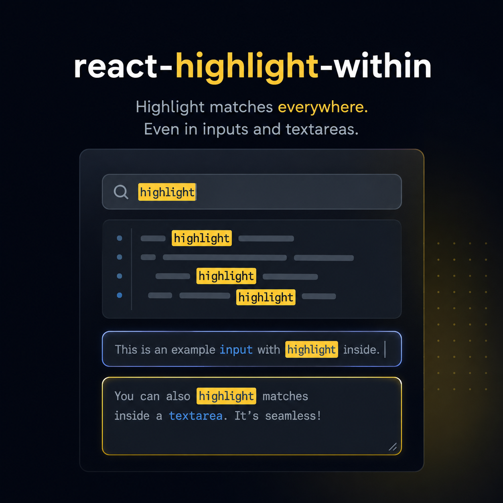

# react-highlight-within

<p align="center">
  
</p>

Component-first search highlighting for real React UIs.

Wrap any subtree with `<HighlightWithin>` and every match — across rendered text, deeply nested children, `<input>`s, and `<textarea>`s — is painted with a `<mark>` the moment a search term is present.

## Features

- Works on the live DOM, not just literal JSX text — catches text from props, dynamic children, portals, and third-party widgets
- Highlights `<input>` and `<textarea>` via a pixel-perfect transparent overlay (opt-in)
- Fully bidirectional — RTL and LTR text both render correctly
- `MutationObserver`-driven sync keeps marks accurate as children update without any extra wiring
- `asChild` mode attaches to your existing element with zero wrapper nodes in the DOM
- `search` accepts a string or a `RegExp`
- **Zero dependencies** — only React (≥ 16.8) is required, which you already have

## Install

```bash
npm install react-highlight-within
```

```bash
yarn add react-highlight-within
```

## Basic usage

```tsx
import { HighlightWithin } from "react-highlight-within";

function SearchResults({ query }: { query: string }) {
  return (
    <HighlightWithin search={query}>
      <article>
        <h1>Learn React</h1>
        <p>Rendered content and nested children all update live.</p>
      </article>
    </HighlightWithin>
  );
}
```

## Highlighting inputs and textareas

Pass `highlightInput` and/or `highlightTextarea` to opt in to form-control highlighting. The component attaches a synchronized overlay behind each control — no layout changes needed on your side.

```tsx
<HighlightWithin search={query} highlightInput highlightTextarea>
  <input value="React input example" readOnly />
  <textarea value="React textarea example" readOnly />
</HighlightWithin>
```

Supported input types: `text`, `search`, `email`, `url`, `tel`.

## `asChild` — zero wrapper nodes

When you need to attach to an existing element without introducing a wrapper `<div>`, use `asChild`. The single React child receives the highlight ref directly.

```tsx
<HighlightWithin search={query} asChild>
  <section>
    <p>No wrapper element added to the DOM.</p>
  </section>
</HighlightWithin>
```

## RegExp search

```tsx
<HighlightWithin search={/react|vue|svelte/i}>
  <p>Compare React, Vue, and Svelte.</p>
</HighlightWithin>
```

When a `RegExp` is passed, `caseSensitive` is ignored — the regex's own `i` flag is authoritative.

## Custom mark styling

**Via props** — fine-tune colors and styles inline:

```tsx
<HighlightWithin
  search={query}
  bgColor="#a8edea"
  textColor="#1a1a1a"
  highlightStyle={{ borderRadius: "3px", padding: "0 2px" }}
>
  ...
</HighlightWithin>
```

**Via CSS class** — set `markClassName` to hand full control to your stylesheet. Built-in inline defaults are removed when this prop is present; `highlightStyle` still overlays on top.

```tsx
<HighlightWithin search={query} markClassName="my-mark">
  ...
</HighlightWithin>
```

```css
.my-mark {
  background: #ffd666;
  color: inherit;
  border-radius: 3px;
}
```

## Props reference

| Prop                | Type                          | Default   | Description                                                               |
| ------------------- | ----------------------------- | --------- | ------------------------------------------------------------------------- |
| `search`            | `string \| RegExp`            | —         | Text or pattern to highlight.                                             |
| `as`                | `keyof HTMLElementTagNameMap` | `"div"`   | Tag for the wrapper element. Ignored when `asChild` is set.               |
| `asChild`           | `boolean`                     | `false`   | Clone the single child element instead of rendering a wrapper.            |
| `highlightInput`    | `boolean`                     | `false`   | Opt in to overlay-based highlighting for `<input>` elements.              |
| `highlightTextarea` | `boolean`                     | `false`   | Opt in to overlay-based highlighting for `<textarea>` elements.           |
| `bgColor`           | `string`                      | `#FFD666` | Background color of each `<mark>`.                                        |
| `textColor`         | `string`                      | `#1C252E` | Text color of each `<mark>`.                                              |
| `caseSensitive`     | `boolean`                     | `false`   | Match case exactly. Ignored when `search` is a `RegExp`.                  |
| `highlightStyle`    | `CSSProperties`               | —         | Extra inline styles merged onto every `<mark>`.                           |
| `markClassName`     | `string`                      | —         | Class applied to every `<mark>`; disables built-in inline color defaults. |

All standard HTML attributes accepted by the wrapper element are forwarded as well.

## Legacy function API

`highlightWithin(element, options)` is kept for backwards compatibility with v1 consumers. It wraps `element` in `<HighlightWithin>` under the hood. New code should use `<HighlightWithin>` directly.

```tsx
import { highlightWithin } from "react-highlight-within";

const highlighted = highlightWithin(<p>Hello world</p>, { search: "world" });
```

## Contributing

Issues and pull requests are welcome. If you want to change behavior or add a feature, open a PR with a clear description and a minimal reproduction.

## License

MIT
